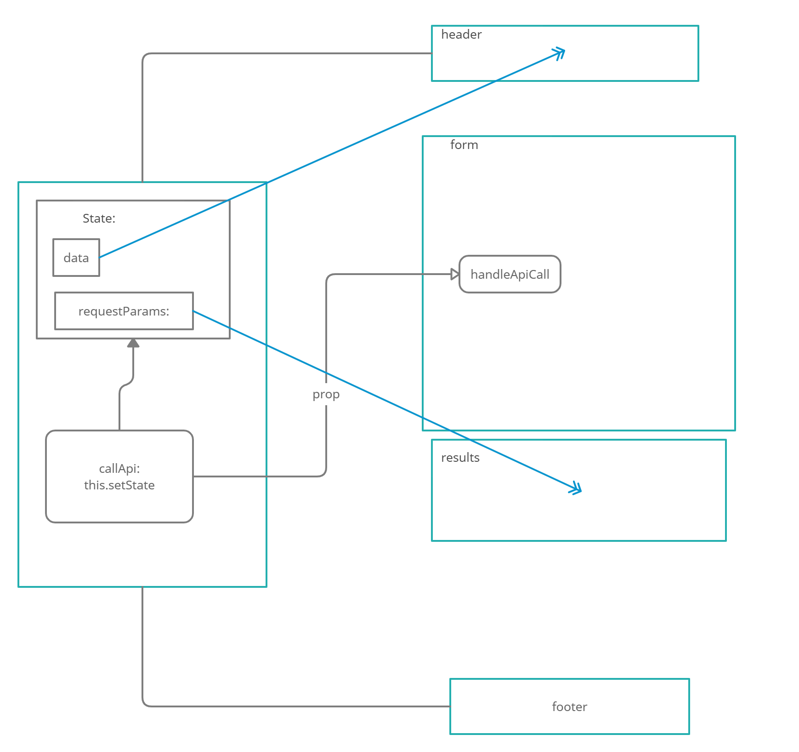

# Lab27 - RESTy - useState() Hook

## Description

### Phase 2 Requirements

In phase 2, we will be receiving user input in preparation of connecting to live APIs, using the useState() hook in our functional components

The following user stories detail the major functionality for this phase of the project.

- As a user, I want to enter the REST Method and URL to an API
- As a user, I want to see a summary of my request as well as results returned from an API request in my browser in a readable format

#### Application Flow:

1. User enters an API URL
2. Chooses a REST Method
3. Clicks the “Go” button
4. Application fetches data from the URL given, with the method specified
5. Displays the response headers and results separately
6. Both headers and results should be “pretty printed” JSON

## Author

Ayrat Gimranov

## UML

<!-- ## CodeSandbox links

[Link1](https://codesandbox.io/s/lab26-resty-rlody?file=/README.md) -->

## Resources

[CodeFellows JS 401 - Lab 26 starter Code](https://github.com/codefellows/seattle-javascript-401n19/tree/main/class-26/lab/starter-code)
